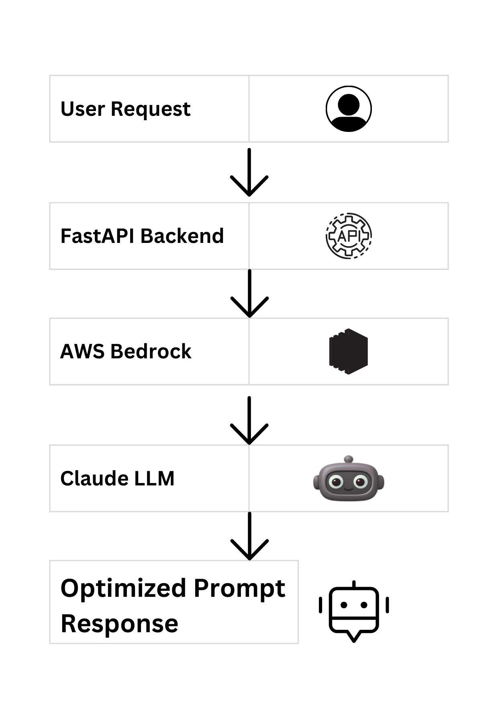

# AI Prompt Advisor API

A Generative AI backend application that improves and optimizes user prompts using AWS Bedrock.

## Project Overview
This project demonstrates how to build and deploy a cloud-based GenAI application using FastAPI and AWS Bedrock. The system receives user prompts, sends them to an LLM (Claude model), and returns optimized prompts and explanations.

## Tech Stack
- Python
- FastAPI
- AWS Bedrock
- Docker
- AWS ECS Fargate
- Amazon ECR
- Pydantic

## Features
- Prompt optimization using LLM
- REST API built with FastAPI
- Cloud deployment using ECS
- Containerized with Docker
- Secure model invocation using IAM

## Architecture
User → FastAPI API → AWS Bedrock → Claude Model → Response

## Deployment
The application is containerized with Docker and deployed on AWS ECS using Amazon ECR.

## Architecture

## Architecture

## API Endpoint

POST /chat

Example Request:
{
  "user_id": "123",
  "message": "Explain solar energy"
}

Example Response:
{
  "output": "Solar energy is..."
}

## Author
Likhitha Jalli
